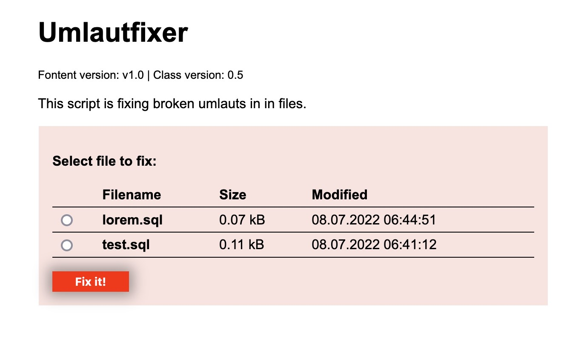

# Umlautfixer

A small PHP class with a simple frontent for fixing broken umlauts such as `ë`, `ö` etc. It uses PHP `str_replace()` for search and replace, so nothing fancy but does a good job for my personal needs.

The class uses replacements listed on [https://www.i18nqa.com/debug/utf8-debug.html](https://www.i18nqa.com/debug/utf8-debug.html) and [https://bueltge.de/wp-content/download/wk/utf-8_kodierungen.pdf](https://bueltge.de/wp-content/download/wk/utf-8_kodierungen.pdf). So thanks to both authors for publishing such lists! But I did'nt implement all of them – just a personal selection I found usefull instead. 

**As always: Use with care an do your backups!**

## Usage
1. Copy the umlaufixer directory to a PHP capable server (MAMP, XAMPP e.g.)
2. Place the broken file, such as a sql dump, in the `input`directory
3. Point your browser to the URL of the umlautfixer folder
4. A list of files in `input` directory should appear (see screenshot)
5. Select the one you wan't to fix, click the _Fix it!_ button
6. Check the `output` directory for the processed file

Note that the file(s) in `input` directory arn't changed by the script, so this is your backup if things go nuts.

## Screenshot

